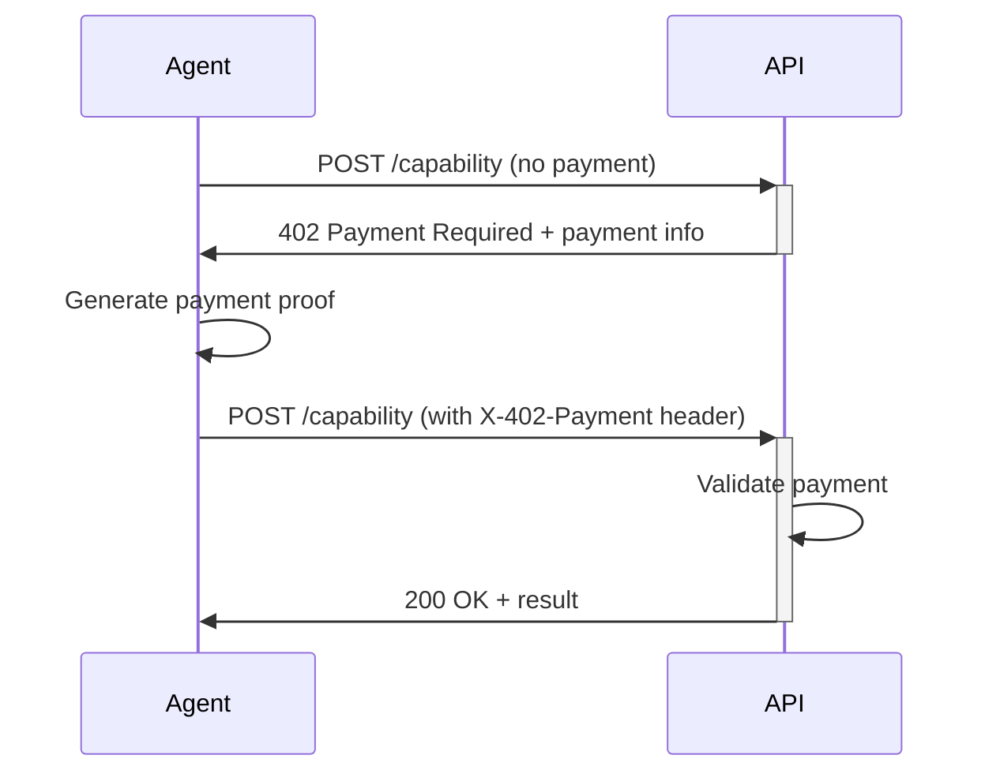

# @agent-bazaar/x402-sdk

A powerful TypeScript SDK for the x402 micropayment protocol, enabling seamless integration of paid capabilities in AI agent ecosystems. Turn any API into a monetized service that agents can discover and pay for automatically.

[](https://www.npmjs.com/package/@agent-bazaar/x402-sdk)
[](https://www.typescriptlang.org/)
[](https://opensource.org/licenses/MIT)

## 🚀 Quick Start

### Installation

```bash
npm install @agent-bazaar/x402-sdk
```

### For API Providers (5-minute setup)

Transform your existing API into a paid capability:

```typescript
import express from "express";
import { x402 } from "@agent-bazaar/x402-sdk";

const app = express();
app.use(express.json());

// Protect your endpoint with micropayments
app.post(
  "/api/code-review",
  x402({
    priceUsd: 0.05,                    // 5 cents per request
    payTo: "0x742d35Cc6634C0532925a3b8D42319d8c",
    capabilityId: "my-code-reviewer",
    description: "GPT-4 powered code review and analysis",
    networks: ["base", "ethereum"],    // Multi-chain support
    tokens: ["USDC", "ETH"]
  }),
  (req, res) => {
    // Your existing logic - only reached after valid payment
    const { code, language } = req.body;
    const review = analyzeCode(code, language);
    res.json({ review, suggestions: review.suggestions });
  }
);

app.listen(3000, () => {
  console.log("💰 x402-enabled API running on port 3000");
});
```

When called without payment, your API automatically returns structured payment information:

```json
{
  "status": 402,
  "payment": {
    "priceUsd": 0.05,
    "payTo": "0x742d35Cc6634C0532925a3b8D42319d8c",
    "networks": ["base", "ethereum"],
    "tokens": ["USDC", "ETH"],
    "description": "GPT-4 powered code review and analysis",
    "capabilityId": "my-code-reviewer"
  }
}
```

### For AI Agents & Applications (Consumer SDK)

Discover and invoke paid capabilities programmatically:

```typescript
import { X402Client } from "@agent-bazaar/x402-sdk";

const client = new X402Client({
  registryUrl: "https://api.agentbazaar.xyz",
  paymentToken: "your-signed-payment-proof"
});

// Discover capabilities by category
const codeCapabilities = await client.discover({ 
  category: "code-generation",
  type: "api"
});

console.log(`Found ${codeCapabilities.length} code generation APIs`);

// Get detailed information about a capability
const capability = await client.get("gpt4-code-review");
console.log(`${capability.name}: $${capability.pricePerCall} per call`);
console.log(`Rating: ${capability.rating}/5 (${capability.usageCount} uses)`);

// Make a paid call
try {
  const result = await client.call("gpt4-code-review", {
    code: "function fibonacci(n) { return n < 2 ? n : fibonacci(n-1) + fibonacci(n-2); }",
    language: "javascript"
  });
  
  console.log("Code review:", result.review);
  console.log("Suggestions:", result.suggestions);
  
} catch (error) {
  if (error.status === 402) {
    console.log("Payment required:");
    console.log(`Price: $${error.payment.priceUsd}`);
    console.log(`Pay to: ${error.payment.payTo}`);
    // Implement payment flow
  }
}
```

## 📖 Core Concepts

### The x402 Protocol

The x402 protocol extends HTTP with a standardized micropayment layer:

1. **Discovery**: Agents discover capabilities through the registry
2. **Pricing**: Empty requests return `402 Payment Required` with payment details
3. **Payment**: Clients attach payment proofs via the `X-402-Payment` header
4. **Validation**: Providers verify payments before executing requests
5. **Analytics**: Usage is tracked for monitoring and revenue insights

### Payment Flow



## 🛠 API Reference

### Middleware

#### `x402(config: X402MiddlewareConfig)`

Express/Connect middleware that protects endpoints with payment requirements.

**Parameters:**
- `config.priceUsd` - Price per request in USD
- `config.payTo` - Cryptocurrency address for payments
- `config.networks?` - Supported blockchain networks (default: `["base"]`)
- `config.tokens?` - Supported payment tokens (default: `["USDC"]`)
- `config.capabilityId?` - Unique identifier for analytics
- `config.description?` - Human-readable payment description
- `config.validatePayment?` - Custom payment validation function
- `config.onPayment?` - Success callback for payment events

### Client

#### `new X402Client(config?: X402ClientConfig)`

Create a client for discovering and calling paid capabilities.

**Parameters:**
- `config.registryUrl?` - Registry API base URL
- `config.paymentToken?` - Default payment token for requests
- `config.wallet?` - Wallet configuration for auto-signing

#### `client.discover(params?)`

Discover capabilities with filtering options.

**Parameters:**
- `params.category?` - Filter by category (`"code-generation"`, `"image-generation"`, etc.)
- `params.search?` - Text search across names and descriptions
- `params.type?` - Filter by type (`"api"`, `"cli"`, `"skill"`)

#### `client.call<T>(capabilityId, payload, options?)`

Execute a paid capability call.

**Parameters:**
- `capabilityId` - Unique capability identifier
- `payload` - Request data to send
- `options.paymentToken?` - Override default payment token

### Registry Functions

#### `registerCapability(capability, registryUrl?)`

Register a new capability in the Agent Bazaar registry.

#### `getCapabilityStats(capabilityId, registryUrl?)`

Retrieve usage statistics and performance metrics.

#### `searchCapabilities(query, registryUrl?)`

Search capabilities by text query.

## 🏗 Advanced Usage

### Custom Payment Validation

Implement your own payment verification logic:

```typescript
import { x402 } from "@agent-bazaar/x402-sdk";

app.post("/api/premium-service", x402({
  priceUsd: 1.0,
  payTo: "0x...",
  async validatePayment(token) {
    // Verify transaction on-chain
    const transaction = await blockchain.getTransaction(token.token);
    
    if (!transaction || transaction.to !== config.payTo) {
      return false;
    }
    
    const amountUsd = convertToUsd(transaction.value, token.network);
    return amountUsd >= config.priceUsd;
  },
  onPayment(token, req) {
    // Log successful payment for accounting
    console.log(`Payment received: ${token.amount} from ${token.payer}`);
    analytics.track("payment_success", {
      capability: "premium-service",
      amount: token.amount,
      payer: token.payer
    });
  }
}), handler);
```

### Dynamic Pricing

Implement usage-based or time-sensitive pricing:

```typescript
app.post("/api/ai-model/:model", (req, res, next) => {
  const { model } = req.params;
  const pricing = {
    "gpt-3.5": 0.01,
    "gpt-4": 0.05,
    "claude": 0.03
  };
  
  // Apply dynamic middleware
  const middleware = x402({
    priceUsd: pricing[model] || 0.02,
    payTo: "0x...",
    capabilityId: `ai-model-${model}`,
    description: `${model} inference request`
  });
  
  middleware(req, res, next);
}, handler);
```

### Usage Analytics

Monitor your capability performance:

```typescript
import { getUsageLog } from "@agent-bazaar/x402-sdk";

// Get usage statistics
const records = getUsageLog("my-capability-id");
const successRate = records.filter(r => r.success).length / records.length;
const avgLatency = records.reduce((sum, r) => sum + r.latencyMs, 0) / records.length;
const totalRevenue = records.reduce((sum, r) => sum + r.amountUsd, 0);

console.log(`Success rate: ${(successRate * 100).toFixed(1)}%`);
console.log(`Average latency: ${avgLatency.toFixed(0)}ms`);
console.log(`Total revenue: $${totalRevenue.toFixed(2)}`);

// Export for external analytics
const analyticsData = records.map(record => ({
  timestamp: new Date(record.timestamp).toISOString(),
  success: record.success,
  latencyMs: record.latencyMs,
  revenue: record.amountUsd,
  payer: record.payer
}));

await uploadToAnalytics(analyticsData);
```

## 🌍 Deployment Examples

### Express.js with Multiple Capabilities

```typescript
import express from "express";
import { x402, registerCapability } from "@agent-bazaar/x402-sdk";

const app = express();
app.use(express.json());

// Code review service
app.post("/api/code-review", 
  x402({ priceUsd: 0.05, payTo: "0x...", capabilityId: "code-review" }),
  codeReviewHandler
);

// Image generation service
app.post("/api/generate-image",
  x402({ priceUsd: 0.25, payTo: "0x...", capabilityId: "image-gen" }),
  imageGenerationHandler
);

// Register capabilities on startup
async function registerCapabilities() {
  await registerCapability({
    name: "GPT-4 Code Reviewer",
    slug: "gpt4-code-review",
    type: "api",
    category: "code-generation",
    pricePerCall: 0.05,
    x402Endpoint: "https://myapi.com/api/code-review",
    description: "AI-powered code review with security analysis",
    longDescription: "Uses GPT-4 to analyze code for bugs, security vulnerabilities, performance issues, and best practices. Supports 20+ programming languages.",
    icon: "https://myapi.com/icons/code-review.png",
    featured: false,
    tags: ["code", "review", "security", "gpt4"],
    creatorName: "My Company"
  });
}

app.listen(3000, async () => {
  await registerCapabilities();
  console.log("🚀 Multi-capability API running");
});
```

### Next.js API Routes

```typescript
// pages/api/ai-chat.ts
import { NextApiRequest, NextApiResponse } from "next";
import { x402 } from "@agent-bazaar/x402-sdk";

const paymentMiddleware = x402({
  priceUsd: 0.02,
  payTo: process.env.PAYMENT_ADDRESS!,
  capabilityId: "ai-chat-nextjs"
});

export default function handler(req: NextApiRequest, res: NextApiResponse) {
  return new Promise((resolve) => {
    paymentMiddleware(req, res, () => {
      // Payment validated - process the chat request
      const { message } = req.body;
      const response = processAIChat(message);
      res.json({ response });
      resolve(undefined);
    });
  });
}
```

### Serverless Functions (Vercel/Netlify)

```typescript
// netlify/functions/ai-service.ts
import { x402 } from "@agent-bazaar/x402-sdk";

const middleware = x402({
  priceUsd: 0.10,
  payTo: "0x...",
  capabilityId: "serverless-ai"
});

export const handler = async (event: any, context: any) => {
  return new Promise((resolve) => {
    const mockRes = {
      statusCode: 200,
      headers: {},
      body: "",
      status: (code: number) => { mockRes.statusCode = code; return mockRes; },
      json: (data: any) => { mockRes.body = JSON.stringify(data); },
      end: () => resolve(mockRes)
    };
    
    middleware(event, mockRes, () => {
      // Process paid request
      const result = processAIRequest(JSON.parse(event.body));
      mockRes.json(result);
      mockRes.end();
    });
  });
};
```

## 🔒 Security Considerations

### Production Payment Validation

Always implement proper on-chain verification for production:

```typescript
import { x402 } from "@agent-bazaar/x402-sdk";
import { ethers } from "ethers";

const provider = new ethers.providers.JsonRpcProvider(process.env.RPC_URL);

app.post("/api/secure-service", x402({
  priceUsd: 0.50,
  payTo: "0x742d35Cc6634C0532925a3b8D42319d8c",
  async validatePayment(token) {
    try {
      // Verify transaction exists and has correct parameters
      const tx = await provider.getTransaction(token.token);
      
      if (!tx || tx.to !== "0x742d35Cc6634C0532925a3b8D42319d8c") {
        return false;
      }
      
      // Check transaction is confirmed
      if (!tx.blockNumber || tx.blockNumber === 0) {
        return false;
      }
      
      // Verify amount (convert from wei to USD)
      const ethPrice = await getEthPrice();
      const amountUsd = parseFloat(ethers.utils.formatEther(tx.value)) * ethPrice;
      
      return amountUsd >= 0.50;
      
    } catch (error) {
      console.error("Payment validation error:", error);
      return false;
    }
  }
}), handler);
```

### Rate Limiting

Combine with rate limiting to prevent abuse:

```typescript
import rateLimit from "express-rate-limit";
import { x402 } from "@agent-bazaar/x402-sdk";

const limiter = rateLimit({
  windowMs: 15 * 60 * 1000, // 15 minutes
  max: 100, // limit each IP to 100 requests per windowMs
  message: "Too many requests from this IP"
});

app.post("/api/service",
  limiter,  // Apply rate limiting first
  x402({ priceUsd: 0.01, payTo: "0x..." }),  // Then payment validation
  handler
);
```

## 🧪 Testing

### Mock Payment Validation

For testing and development:

```typescript
import { x402 } from "@agent-bazaar/x402-sdk";

const isDevelopment = process.env.NODE_ENV === "development";

app.post("/api/test-service", x402({
  priceUsd: 0.01,
  payTo: "0x...",
  validatePayment: isDevelopment 
    ? async () => true  // Accept all payments in development
    : productionValidator
}), handler);
```

### Unit Testing

```typescript
import request from "supertest";
import express from "express";
import { x402 } from "@agent-bazaar/x402-sdk";

describe("x402 middleware", () => {
  const app = express();
  app.use(express.json());
  
  app.post("/test", x402({
    priceUsd: 0.01,
    payTo: "0x123",
    validatePayment: async () => true
  }), (req, res) => {
    res.json({ success: true });
  });
  
  it("should require payment", async () => {
    const response = await request(app)
      .post("/test")
      .expect(402);
      
    expect(response.body.payment.priceUsd).toBe(0.01);
  });
  
  it("should accept valid payment", async () => {
    const response = await request(app)
      .post("/test")
      .set("X-402-Payment", '{"token":"valid","network":"base","amount":"0.01","payer":"0x456"}')
      .expect(200);
      
    expect(response.body.success).toBe(true);
  });
});
```

## 🤝 Contributing

We welcome contributions! Please see our [Contributing Guide](CONTRIBUTING.md) for details.

### Development Setup

```bash
# Clone the repository
git clone https://github.com/agent-bazaar/x402-sdk.git
cd x402-sdk

# Install dependencies
npm install

# Run tests
npm test

# Build the package
npm run build

# Start development mode
npm run dev
```

## 📄 License

MIT License - see [LICENSE](LICENSE) file for details.

## 🆘 Support

- 📚 [Documentation](https://docs.agentbazaar.xyz)
- 💬 [Discord Community](https://discord.gg/agentbazaar)
- 🐛 [Issues](https://github.com/agent-bazaar/x402-sdk/issues)
- 📧 [Email Support](mailto:support@agentbazaar.xyz)

---

Built with ❤️ by the Agent Bazaar team. Making AI capabilities accessible through micropayments.